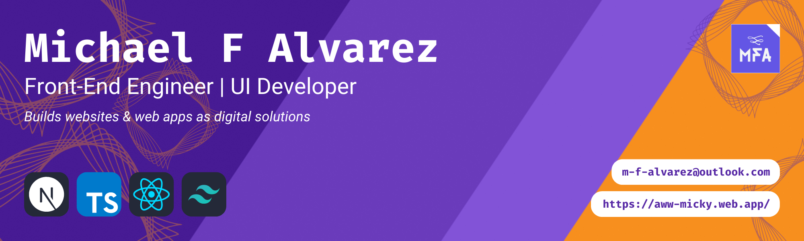
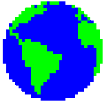

<div align="center">
  <h1>
    &nbsp;
    <b>Hola, nice to meet ya</b>
    
  </h1>

  <h2>
    <span>Got a project idea?</span>
    <span>Let's get in touch</span>
  </h2>

  [ ![email][email-badge] ][email-link] &nbsp;
  [ ![phone][phone-badge] ][phone-link] &nbsp;
  [ ![resume][resume-badge] ][resume-link] &nbsp;
  [ ![calendly][calendly-badge] ][calendly-link] &nbsp;
  [ ![linkedin][linkedin-badge] ][linkedin-link] &nbsp;
  [ ![twitter][twitter-badge] ][twitter-link]

  [ ![gh-page][gh-page-badge] ][gh-page-link] &nbsp;
  [ ![gh-readme][gh-readme-badge] ][gh-readme-link]

  <kbd><a href="https://aww-micky.web.app">aww-micky.web.app</a></kbd>
</div>

![<hr />][hr-snapshot]

## Who I Am 

```js
const Michael_Alvarez = {
  summary    : 'I build digital solutions for SaaS products & marketing agencies',
  roles      : [ 'Front-End Engineer', 'UI Developer', 'Design Thinker' ],
  interests  : [ 'Headless CMS', 'Serverless Functions', 'JAM Stack' ],
  key_values : [ 'curious', 'collaborative', 'creative' ],
  type_check : true && '~ 𝚖𝚘𝚗𝚘𝚜𝚙𝚊𝚌𝚎 𝚛𝚞𝚕𝚎𝚜 ~',
  nickname   : ( 'micky' || 'zoda' ),
}
```

![<hr />][hr-snapshot]

## What I know 

### Tools I use on a daily basis

<a 
target="_blank" 
title="open 'skill icons' repo" 
href="https://github.com/tandpfun/skill-icons#readme">
  
</a>

### Tools I am interested to learn

[ ![jam-stack][jam-stack-badge] ][jam-stack-link] &nbsp;
[ ![storybook][storybook-badge] ][storybook-link] &nbsp;
[ ![graphql][graphql-badge] ][graphql-link] &nbsp;
[ ![apollo][apollo-badge] ][apollo-link] &nbsp;
[ ![trpc][trpc-badge] ][trpc-link] &nbsp;
[ ![prisma][prisma-badge] ][prisma-link]

[ ![testing-library][testing-library-badge] ][testing-library-link] &nbsp;
[ ![jest][jest-badge] ][jest-link] &nbsp;
[ ![cypress][cypress-badge] ][cypress-link] &nbsp;
[ ![playwright][playwright-badge] ][playwright-link]

[ ![sanity.io][sanity-badge] ][sanity-link] &nbsp;
[ ![contentful][contentful-badge] ][contentful-link] &nbsp;
[ ![strapi][strapi-badge] ][strapi-link] &nbsp;
[ ![prismic][prismic-badge] ][prismic-link] &nbsp;
[ ![storyblok][storyblok-badge] ][storyblok-link] &nbsp;
[ ![hygraph][hygraph-badge] ][hygraph-link]


<details>
<summary>
<b>What is my current tech stack?</b>
</summary>


<table>
<tbody>
<!-- BASE - Web Development -->
<tr>
  <td>
  <details>
  <summary>
  <code>BASE - Web Development</code>
  </summary>
  
  ```
  TypeScript        :: type safety transpiler
  Vite              :: build tool
  Next.js           :: SSR & SSG framework
  React             :: js framework/library
  ```

  </details>
  </td>
  <td>

  [ ![typescript][typescript-badge] ][typescript-link]
  [ ![vite][vite-badge] ][vite-link]
  [ ![next.js][next.js-badge] ][next.js-link]
  [ ![react][react-badge] ][react-link]

  </td>
</tr>
<!-- UI - Component-Driven Development -->
<tr>
  <td>
  <details>
  <summary>
  <code>UI - Component-Driven Development</code>
  </summary>
  
  ```
  Sass              :: css preprocessor
  Tailwind CSS      :: css framework/library
  Twin Macro        :: tailwind compiler tool
  Styled-Components :: css-in-jsx
  Framer Motion     :: react motion library
  ```

  </details>
  </td>
  <td>

  [ ![sass][sass-badge] ][sass-link]
  [ ![tailwind-css][tailwind-css-badge] ][tailwind-css-link]
  [ ![twin-macro][twin-macro-badge] ][twin-macro-link]
  [ ![styled-components][styled-components-badge] ][styled-components-link]
  [ ![framer-motion][framer-motion-badge] ][framer-motion-link]

  </td>
</tr>
<!-- API - Data-Driven Development -->
<tr>
  <td>
  <details>
  <summary>
  <code>API - Data-Driven Development</code>
  </summary>
  
  ```
  Zustand         :: global state management (for ui data)
  React Query     :: async state management (for api data)
  React Router    :: routing state management
  React Hook Form :: form state management
  Zod             :: schema declaration & validation
  Ky              :: promise-based http request
  ```

  </details>
  </td>
  <td>

  [ ![zustand][zustand-badge] ][zustand-link]
  [ ![react-query][react-query-badge] ][react-query-link]
  [ ![react-router][react-router-badge] ][react-router-link]
  [ ![react-hook-form][react-hook-form-badge] ][react-hook-form-link]
  [ ![zod][zod-badge] ][zod-link]
  [ ![ky][ky-badge] ][ky-link]

  </td>
</tr>
</tbody>
</table>
</details>


<details>
<summary>
<i>What I deep dive into, experiment?</i>
</summary>
<br />

| | |
| - | - |
| Framer Motion     | [ ![framer-motion][framer-motion-badge] ][framer-motion-link] |
| Three.js | [ ![three.js][three.js-badge] ][three.js-link] |
| P5.js    | [ ![p5.js][p5.js-badge] ][p5.js-link] |
| Green Sock (GSAP) | [ ![green-sock][green-sock-badge] ][green-sock-link] |
| WebGL    | [ ![webgl][webgl-badge] ][webgl-link] |
| SVG (Animation)   | [ ![svg][svg-badge] ][svg-link] |
| Canvas   | [ ![canvas][canvas-badge] ][canvas-link] |
</details>

<details>
<summary>
<i>What challenges do I think about?</i>
</summary>
<br />

> How to build from design system to ui library?

`e.g.` figma, zeplin, react, storybook

> How to type check specific data?

`e.g.` async data, form data, generic props

> How to integrate these technologies?

`e.g.` tRPC, Prisma, PlanetScale

> How to compose content strategy for Headless CMS projects?

`i.e.` content structure, repeat content usage, real-time collaboration

> How to improve & maintain web performance for build time?

`i.e.` import sizes, image optimizations, reusable components

> How to manage service costs?
  
`i.e.` api usage, run server, data analytics

> What otherly things can I learn to make?

- creative coding
- generative art
- digital art (media, interactive)

</details>

![<hr />][hr-snapshot]

<!-- ## Have a project idea? Let's talk -->

## GH Stats 📈

<a 
target="_blank" 
title="open 'github-readme-stats' repo" 
href="https://github.com/anuraghazra/github-readme-stats#readme">
  
  
</a>

<a 
target="_blank" 
title="open 'generate snake' repo" 
href="https://github.com/Platane/snk#readme">
  
</a>

<div align="center">
  <a 
  target="_blank" 
  title="open 'readme typing svg' repo"
  href="https://github.com/DenverCoder1/readme-typing-svg#readme">
    
  </a>
</div>

<div align="center">

[ ![💭 Ask Me Anything][ama-badge] ][ama-link] &nbsp;
[ ![👀 Click Any Badge][resource-badge] ][resource-link] &nbsp;
[ ![🤍 Open Source Software][oss-badge] ][oss-link]

`(╯°□°)╯彡 ┻━┻ ` &nbsp; `๑๑๑  ﾐ ʕ•ᴥ•;ʔ`

<kbd><a href="https://aww-micky.web.app">aww-micky.web.app</a></kbd>
</div>

![<hr />][hr-snapshot]

<!-- 
========================
====== ACCESSORY ====== 
========================
-->

[hr-snapshot]: https://capsule-render.vercel.app/api?type=rect&color=gradient&height=2.5

<!-- 
==================
====== SOCIAL ====== 
==================
-->

<!-- Portfolio -->
[portfolio-link]: https://rebrand.ly/michael-f-alvarez__portfolio
[portfolio-badge]: https://img.shields.io/website-live-issue-sucess-important/https/aww-micky.web.app/?style=for-the-badge

<!-- Email -->
[email-link]: mailto:m-f-alvarez@outlook.com
[email-badge]: https://img.shields.io/badge/📧_Email-CF1920?style=for-the-badge
<!-- Phone -->
[phone-link]: https://rebrand.ly/michael-f-alvarez__phone
[phone-badge]: https://img.shields.io/badge/📞_Phone-08a35f?style=for-the-badge
<!-- Resume -->
[resume-link]: https://rebrand.ly/michael-f-alvarez__resume
[resume-badge]: https://img.shields.io/badge/📄_Resume-DFDFDF?style=for-the-badge
<!-- Calendly -->
[calendly-link]: https://calendly.com/michael-f-alvarez/meetup
[calendly-badge]: https://img.shields.io/badge/📅_Calendly-006BFF?style=for-the-badge
<!-- LinkedIn -->
[linkedin-link]: https://linkedin.com/in/awwmicky
[linkedin-badge]: https://img.shields.io/badge/LinkedIn-0077B5?logoColor=FFF&style=for-the-badge&logo=linkedin
<!-- Twitter -->
[twitter-link]: https://twitter.com/awwmicky
[twitter-badge]: https://img.shields.io/badge/Twitter-1DA1F2?logoColor=FFF&style=for-the-badge&logo=twitter

<!-- GitHub -->
[gh-page-link]: https://github.com/awwmicky/awwmicky.github.io
[gh-readme-link]: https://github.com/awwmicky/awwmicky
[gh-page-badge]: https://img.shields.io/badge/GH_PAGE-222222?labelColor=333333&logoColor=FFF&style=flat&logo=github
[gh-readme-badge]: https://img.shields.io/badge/GH_README-222222?labelColor=333333&logoColor=FFF&style=flat&logo=github

<!-- 
========================
====== ALTERNATIVE ======  
========================
-->

<!-- ama -->
[ama-link]: https://github.com/awwmicky/awwmicky/issues/new
[ama-badge]: https://img.shields.io/badge/Ask_me_anything-💭_Let's_chat-33CC99
<!-- shield -->
[resource-link]: ./docs/index.md
[resource-badge]: https://img.shields.io/badge/Click_any_badges-👀_For_resources-FFF
<!-- oss -->
[oss-link]: https://github.com/ellerbrock/open-source-badges/
[oss-badge]: https://badges.frapsoft.com/os/v2/open-source.svg


<!-- 
======================== 
====== TECH STACK ====== 
======================== 
-->

<!-- TypeScript -->

[typescript-link]: https://typescriptlang.org/
[typescript-badge]: https://img.shields.io/badge/TypeScript-3178C6?logoColor=FFF&logo=typescript

<!-- Vite -->

[vite-link]: https://vitejs.dev/
[vite-badge]: https://img.shields.io/badge/Vite-B73BFE?logoColor=FFD62E&logo=vite

<!-- Next.js -->

[next.js-link]: https://nextjs.org/
[next.js-badge]: https://img.shields.io/badge/Next.js-000?logoColor=FFF&logo=next.js

<!-- React -->

[react-link]: https://reactjs.org/
[react-badge]: https://img.shields.io/badge/React.js-00D8FF?logoColor=20232A&logo=react

<!-- 
======================== 
-->

<!-- Sass -->

[sass-link]: https://sass-lang.com/
[sass-badge]: https://img.shields.io/badge/Sass-CC6699?logoColor=FFFFFF&style=flat-square&logo=sass

<!-- Tailwind CSS -->

[tailwind-css-link]: https://tailwindcss.com/
[tailwind-css-badge]: https://img.shields.io/badge/Tailwind_CSS-38BDF8?&logoColor=FFF&logo=tailwind-css

<!-- Twin Macro -->

[twin-macro-link]: https://tailwindcss.com/
[twin-macro-badge]: https://img.shields.io/badge/Twin_Macro-C100E0?&logoColor=FFF&logo=addthis

<!-- Styled-Components -->

[styled-components-link]: https://styled-components.com/
[styled-components-badge]: https://img.shields.io/badge/Styled--Components-DB7093?logoColor=FFF&logo=styled-components

<!-- Framer Motion -->

[framer-motion-link]: https://framer.com/motion/
[framer-motion-badge]: https://img.shields.io/badge/Framer_Motion-DA39A3?logoColor=FFF&logo=framer

<!-- 
======================== 
-->

<!-- Zustand -->

[zustand-link]: https://zustand-demo.pmnd.rs/
[zustand-badge]: https://img.shields.io/badge/Zustand-716257?logoColor=FFF&logo=addthis

<!-- React Query -->

[react-query-link]: https://tanstack.com/query/
[react-query-badge]: https://img.shields.io/badge/React_Query-FF4154?logoColor=FFD94C&logo=react-query

<!-- React Router -->

[react-router-link]: https://reactrouter.com/
[react-router-badge]: https://img.shields.io/badge/React_Router-CA4245?logoColor=FFF&logo=react-router

<!-- React Hook Form -->

[react-hook-form-link]: https://react-hook-form.com/
[react-hook-form-badge]: https://img.shields.io/badge/React_Hook_Form-EC5990?logoColor=FFF&logo=react-hook-form

<!-- Zod -->

[zod-link]: https://zod.dev/
[zod-badge]: https://img.shields.io/badge/Zod-3068B7?logoColor=FFF&logo=addthis

<!-- Ky -->

[ky-link]: https://npmjs.com/package/ky
[ky-badge]: https://img.shields.io/badge/Ky-F1423D?logoColor=FFF&logo=addthis

<!-- 
======================== 
-->

<!-- JSON Server -->

[json-server-link]: https://npmjs.com/package/json-server
[json-server-badge]: https://img.shields.io/badge/JSON--Server-1E3A8A?logoColor=FFF&logo=json

<!-- 
======================== 
====== LEARNING ====== 
======================== 
-->

<!-- JAM Stack -->

[jam-stack-link]: https://jamstack.org/
[jam-stack-badge]: https://img.shields.io/badge/JAM_Stack-F00080?logoColor=FFF&logo=jamstack

<!-- Storybook -->

[storybook-link]: https://storybook.js.org/
[storybook-badge]: https://img.shields.io/badge/Storybook-FF4785?logoColor=FFF&logo=storybook

<!-- GraphQL -->

[graphql-link]: https://graphql.org/
[graphql-badge]: https://img.shields.io/badge/GraphQL-E10098?logoColor=FFF&logo=graphql

<!-- Apollo -->

[apollo-link]: https://apollographql.com/
[apollo-badge]: https://img.shields.io/badge/Apollo-311C87?logoColor=FFF&logo=apollo-graphql

<!-- tRPC -->
[trpc-link]: https://trpc.io/
[trpc-badge]: https://img.shields.io/badge/tRPC-2596BE?logoColor=FFF&logo=trpc

<!-- Prisma -->
[prisma-link]: https://prisma.io/
[prisma-badge]: https://img.shields.io/badge/Prisma-2D3748?logoColor=FFF&logo=prisma

<!-- 
====================
====== TESTING ====== 
====================
-->

<!-- Testing Library -->

[testing-library-link]: https://testing-library.com/
[testing-library-badge]: https://img.shields.io/badge/Testing_Library-E33332?logoColor=FFF&logo=testing-library

<!-- Jest -->

[jest-link]: https://jestjs.io/
[jest-badge]: https://img.shields.io/badge/Jest-C21325?logoColor=FFF&logo=jest

<!-- Cypress -->

[cypress-link]: https://cypress.io/
[cypress-badge]: https://img.shields.io/badge/Cypress-17202C?logoColor=FFF&logo=cypress

<!-- Playwright -->

[playwright-link]: https://playwright.dev/
[playwright-badge]: https://img.shields.io/badge/Playwright-45BA4B?logoColor=FFF&logo=playwright

<!-- 
==================
====== CMS ======= 
==================
-->

<!-- sanity -->

[sanity-link]: https://sanity.io/
[sanity-badge]: https://img.shields.io/badge/Sanity-F03E2F?logoColor=000&logo=addthis

<!-- contentful -->

[contentful-link]: https://contentful.com/
[contentful-badge]: https://img.shields.io/badge/Contentful-0B6AE6?logoColor=000&logo=addthis

<!-- strapi -->

[strapi-link]: https://strapi.io/
[strapi-badge]: https://img.shields.io/badge/Strapi-8C4bFF?logoColor=000&logo=addthis

<!-- prismic -->

[prismic-link]: https://prismic.io/
[prismic-badge]: https://img.shields.io/badge/Prismic-5163BA?logoColor=000&logo=addthis

<!-- storyblok -->

[storyblok-link]: https://storyblok.com/home
[storyblok-badge]: https://img.shields.io/badge/Storyblok-00B3B0?logoColor=000&logo=addthis

<!-- hygraph -->

[hygraph-link]: https://hygraph.com/
[hygraph-badge]: https://img.shields.io/badge/Hygraph-090E24?logoColor=FFF&logo=addthis

<!-- 
========================= 
====== GRAPHICS ======= 
========================= 
-->

<!-- Three.js -->

[three.js-link]: https://threejs.org/
[three.js-badge]: https://img.shields.io/badge/Three.js-000?logoColor=FFF&logo=three.js

<!-- Green Sock (GSAP) -->

[green-sock-link]: https://greensock.com/gsap/
[green-sock-badge]: https://img.shields.io/badge/Green_Sock-88CE02?logoColor=000&logo=greensock

<!-- P5.js -->

[p5.js-link]: https://p5js.org/
[p5.js-badge]: https://img.shields.io/badge/P5.js-ED225D?logoColor=FFF&logo=p5.js

<!-- SVG (Animation) -->

[svg-link]: https://w3.org/Graphics/SVG/
[svg-badge]: https://img.shields.io/badge/SVG-FFB13B?logoColor=000&logo=svg

<!-- Canvas -->

[canvas-link]: https://w3.org/WAI/PF/HTML/wiki/Canvas
[canvas-badge]: https://img.shields.io/badge/Canvas-9BDC10?logoColor=000&logo=addthis

<!-- WebGL -->

[webgl-link]: https://get.webgl.org/
[webgl-badge]: https://img.shields.io/badge/WebGL-990000?logoColor=FFF&logo=webgl